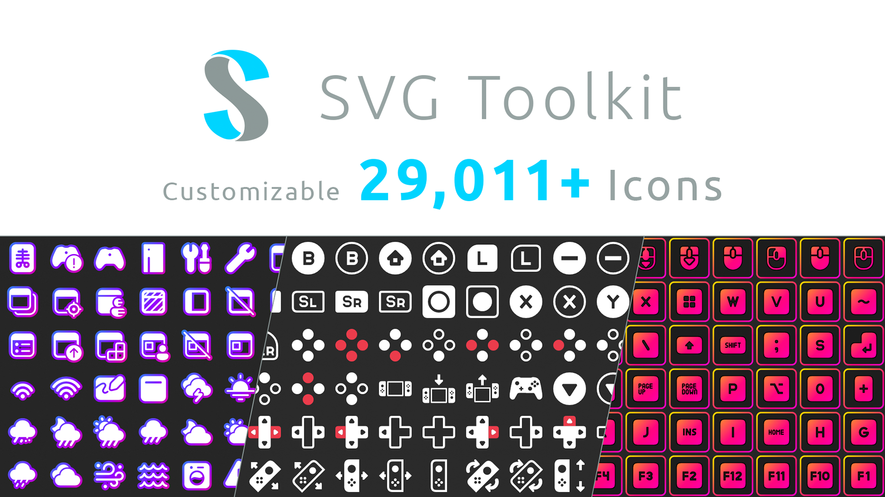
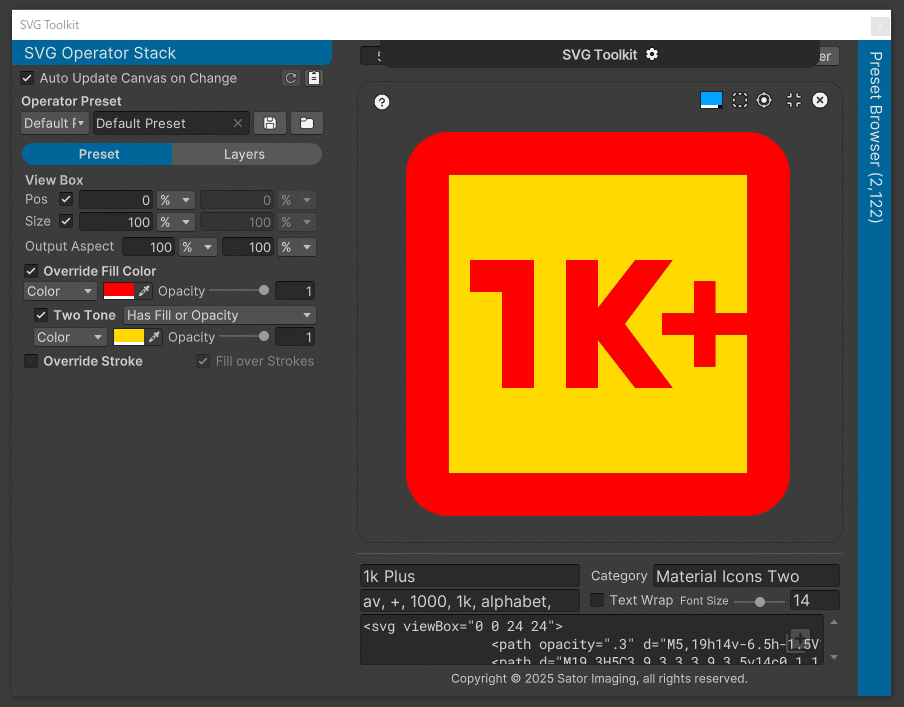
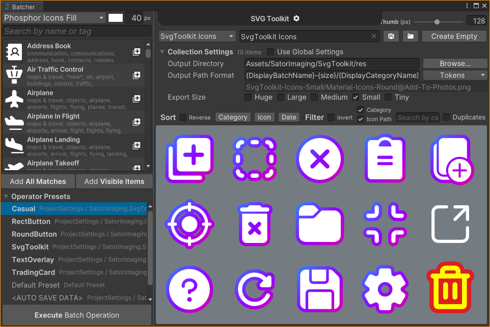

<!-- omit in toc -->
## Table of Contents

- [Changelog](#changelog)
- [Getting Started](#getting-started)
    - [Tutorial Videos](#tutorial-videos)
- [Additional Preset Libraries](#additional-preset-libraries)
    - [Game Icons - CC BY 3.0](#game-icons---cc-by-30)
    - [Emoji One](#emoji-one)
- [In-Depth: **SVG Toolkit**](#in-depth-svg-toolkit)
    - [Canvas Coordinate System](#canvas-coordinate-system)
    - [Two-Tone Preset](#two-tone-preset)
        - [How To: Gap Correction](#how-to-gap-correction)
    - [Stroke Mode](#stroke-mode)
- [In-Depth: **Batcher**](#in-depth-batcher)
    - [Batcher Collection File](#batcher-collection-file)
    - [Tips \& Notes](#tips--notes)
        - [Multiple Visual Styles](#multiple-visual-styles)
        - [Best Export Size](#best-export-size)
        - [Thumbnail View](#thumbnail-view)
    - [Operator Override](#operator-override)
        - [Example](#example)
        - [Further Reading](#further-reading)
    - [Output Path Format Tokens](#output-path-format-tokens)
- [Format Specification](#format-specification)
    - [Custom Preset Library](#custom-preset-library)
        - [Catalog `.stkcatalog`](#catalog-stkcatalog)
        - [Presets `.stkpresets`](#presets-stkpresets)
        - [Strokes Collection](#strokes-collection)
        - [Two-Tone Collection](#two-tone-collection)
    - [Batcher Collection `.stkbatchop`](#batcher-collection-stkbatchop)


# Changelog

Follow us on [**X (formerly Twitter)**](https://x.com/sator_imaging) and [**YouTube**](https://www.youtube.com/@SatorImaging) for latest updates!!

- 1.0.0
    - First release.


# Getting Started

Before watching tutorial videos, open SVG Toolkit window by selecting menu in Unity editor.
- `Tools > SVG Toolkit > Toolkit`
- `Tools > SVG Toolkit > Batcher`


## Tutorial Videos

> [!TIP]
> <span class="flag-icon flag-icon-jp -flag-icon-squared"></span> 日本語字幕、中国語・韓国語機械翻訳あり。  
> <span class="flag-icon flag-icon-cn -flag-icon-squared"></span> 提供日语字幕和中文/韩文机器翻译。  
> <span class="flag-icon flag-icon-kr -flag-icon-squared"></span> 일본어 자막과 중국어/한국어 기계 번역이 제공됩니다.  
> <span class="flag-icon flag-icon-us -flag-icon-squared"></span> Japanese subtitles and Chinese/Korean machine-translations are available.  

| Part 1 | Part 2 |
|:------:|:------:|
| [](https://www.youtube.com/watch?v=W_nWeXuXP_A) | [](https://www.youtube.com/watch?v=gQIjbI0yLcA)
| **Toolkit** | **Batcher** |


# Additional Preset Libraries

You can install additional preset libraries. See repository description for license and installation instructions.


## Game Icons - CC BY 3.0

https://github.com/sator-imaging/StkPreset-Game-Icons


## Emoji One

T.B.D.


# In-Depth: **SVG Toolkit**

## Canvas Coordinate System

The `Canvas` coordinate system is *NOT* included in the SVG specification, but SVG Tookit will magically process it, even though it is marked `experimental`.

If you encounter problems with the canvas coordinate system, feel free to contact us on our [**X (formerly Twitter)**](https://x.com/sator_imaging) or official Unity forum.


## Two-Tone Preset

To set secondary color, enable Two-Tone and set Target option to `Has Fill or Opacity`.


### How To: Gap Correction

> [!TIP]
> `Material Icons Two Tone` collection has gap between shapes. To solve the problem, add thin strokes to fill these gaps.




## Stroke Mode

<!-- omit in toc -->
### Cap Mode


<!-- omit in toc -->
### Corner Mode


&ast; Image courtesy of MDN (https://developer.mozilla.org/en-US/docs/Web/SVG)


# In-Depth: **Batcher**

## Batcher Collection File

Batcher collection file stores *snapshot* of added SVG icon presets.

It means that when source *.svg* preset is updated, added icon *DON'T* get changed so that you need to add updated icon to Batcher and remove older one manually, by finding item with `Duplicates` filter.

> [!TIP]
> With this behavior, you can copy & paste SVG source code directly from website to add it to Batcher collection on the fly. No need to save it in your local storage. (take care about SVG license)


## Tips & Notes

### Multiple Visual Styles

> [!TIP]
> If you want to export a collection with multiple visual styles, use `{operator}` or `{DisplayOperatorName}` token in export path format.


### Best Export Size

> [!TIP]
> Some icon collections are designed and crisp rendered in 24px or multiplier.
> To use non-power-of-2 textures efficiently, consider packing generated icons into texture atlas by sprite packer.


### Thumbnail View

> [!NOTE]
> Unity has hard coded limit of maximum number of `Texture2D` objects loded in Unity Editor environment.
> If you set thumbnail size so small, Batcher shows notification that it has reached to  limit.
> 
> Note that limit affects only display. Collection items are correctly handled inside.


## Operator Override

> [!TIP]
> You can *ignore* or *override* operator settings by using `style` attribute for root `<svg>` tag or descendant SVG elements.


### Example

For example, adding `style="stroke:none"` will ignore all of stroke settings in operator.

```svg
<svg... style="stroke: none">
    <!-- preset contents -->
</svg>
```


In same way, you can add `style="fill:red"` to override fill colors in operator settings.

```svg
<svg... style="fill: red">
    <!-- preset contents -->
</svg>
```


In SVG Toolkit development, we used this technique to merge multiple collection into one single collection.

> As you can see, 2 icons listed at bottom right of window override and ignore fill & stroke colors from operator.




### Further Reading

You can see the following reference to understand SVG markup language & CSS styles.
- [SVG: Scalable Vector Graphics | MDN](https://developer.mozilla.org/en-US/docs/Web/SVG)


## Output Path Format Tokens

`Display...` tokens are replaced with `Kebab-Case`, other tokens are replaced with `PascalCase`.

- Ex: `my batch collection`
    - DisplayBatchName: `My-Batch-Collection`
    - batch: `MyBatchCollection`


# Format Specification

## Custom Preset Library

Preset library consists of the following 2 files.

### Catalog `.stkcatalog`

JSON file with file extension `.stkcatalog`, with the following properties.

- licenseTitle: `string?`
- licenseTerms: `stirng?`
- icons: `Icon[]?`
    - p: `string?` preset file **p**ath in `.zip` archive
    - t: `string?` comma separated **t**ags
    - XmlString: `string?` must be *omitted* for read-only presets

> [!TIP]
> If both license properties are filled, SVG Toolkit shows confirmation dialog in preset browser.


### Presets `.stkpresets`

Generic Zip archive containing SVG preset files.
SVG Toolkit will always load content as SVG so that file extension for files in zip archive can be omitted.

> [!NOTE]
> SVG Toolkit expects preset to have no fill, stroke or opacity attributes on SVG elements.


### Strokes Collection

SVG Toolkit will treat the preset as a stroke collection if it has ` stroke=\"` (leading one white space included) in the root `<svg>` tag.

> [!NOTE]
> SVG Toolkit does *NOT* validate that preset is correctly setted up.


### Two-Tone Collection

For two-tone preset, add `fill` and/or `opacity` (recommended) attribute to shapes that you want to assign secondary color.

> [!NOTE]
> Two-Tone Target option has option for `style` attribute but it should not be used. It is designed to use with *.svg* files exported from Affinity Designer, Adobe Illustrator or other drawing applications.


## Batcher Collection `.stkbatchop`

T.B.D.
